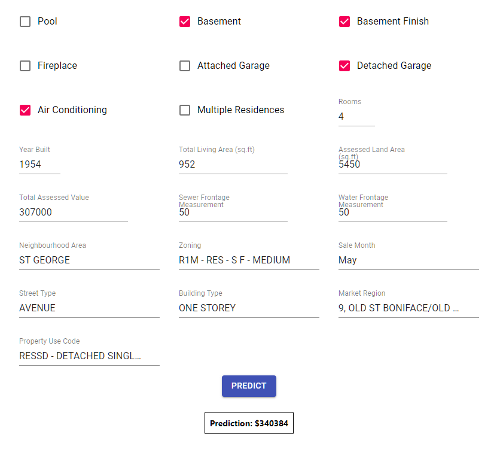

# PropertyIQ 🏠🧠

A machine learning-powered house price prediction system for Winnipeg real estate, featuring data processing pipelines, ML model training, and an interactive web application.

## 🎯 Overview

The City of Winnipeg releases comprehensive sales data for houses and condominiums every 2 years in PDF format ([Sales Books](https://assessment.winnipeg.ca/AsmtTax/English/SelfService/SalesBooks.stm)). This project transforms that raw data into actionable insights by:

- **Extracting and processing** PDF sales data into structured datasets
- **Training ML models** using scikit-learn to predict house prices based on property features
- **Providing an intuitive web interface** for real-time price predictions

The model leverages property characteristics from the [Winnipeg Tax Assessment dataset](https://data.winnipeg.ca/Assessment-Taxation-Corporate/Assessment-Parcels/d4mq-wa44) including living area, land area, number of rooms, basement/pool presence, and more.



## 🏗️ Architecture

```
├── model/           # ML pipeline & data processing
├── webapp/          # React frontend application  
├── server/          # Flask API backend
└── README.md        # This file
```

### Key Features
- PDF-to-CSV data extraction pipeline (using Tabula for PDF processing)
- Feature engineering and data preprocessing
- Trained scikit-learn regression model
- React TypeScript frontend with form validation
- Flask REST API for predictions
- Real-time price predictions

## 🚀 Quick Start

### Prerequisites
- **Python 3.8+** - [Download here](https://www.python.org/downloads/)
- **Node.js 16+** with **pnpm** - [Install pnpm](https://pnpm.io/installation)
- **Git** for version control

### 1. Clone Repository
```bash
git clone <repository-url>
cd repository
```

### 2. Train the Model
```bash
cd model/
# Follow instructions in model/README.md to process data and train the model
```

### 3. Start the Backend Server
```bash
cd server/
py -m pip install -r requirements.txt
py server.py
```
✅ Server running at `http://localhost:5000`

### 4. Start the Frontend
```bash
cd webapp/
pnpm install
pnpm dev --host
```
✅ Web app running at `http://localhost:3000`

### 5. Test the Application
Visit `http://localhost:3000` in your browser and input house features to get price predictions!

## 📊 Data Sources

- **Sales Data**: City of Winnipeg biennial house/condo sales (PDF format, 2016-2021)
  - *Note: [Tabula](https://tabula.technology/) was used externally to extract data from PDF sales books into CSV format for model consumption*
- **Property Features**: Winnipeg Tax Assessment parcels dataset
- **Coverage**: Houses only (condos excluded from current model)

## 🛠️ Development Setup

### Recommended VS Code Extensions
```json
{
  "recommendations": [
    "ms-python.python",
    "ms-toolsai.jupyter", 
    "dbaeumer.vscode-eslint",
    "esbenp.prettier-vscode",
    "GraphQL.vscode-graphql"
  ]
}
```

### Project Structure Details
- `model/notebooks/` - Jupyter notebooks for data analysis and training
- `model/datasets/` - Raw PDF data and processed CSV files
- `webapp/src/` - React components and styling
- `server/` - Flask API with prediction endpoint

## 📈 Model Performance

The model uses property features including:
- Living area (sq ft)
- Land area (sq ft) 
- Number of rooms/bedrooms/bathrooms
- Basement/pool presence
- Property age and condition

*For detailed performance metrics, see `model/notebooks/train_model.ipynb`*

## 🤝 Contributing

1. Fork the repository
2. Create a feature branch (`git checkout -b feature/amazing-feature`)
3. Commit changes (`git commit -m 'Add amazing feature'`)
4. Push to branch (`git push origin feature/amazing-feature`)
5. Open a Pull Request

## 📝 License
This project was developed as part of a work term at Norima Technologies (January–April 2022). Please ensure compliance with City of Winnipeg data usage guidelines when using or distributing this repository.

---

**Note**: This model is for educational/demonstration purposes. Actual real estate valuations should involve professional appraisals and additional market factors.

